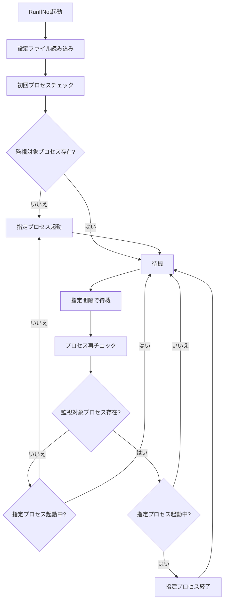

# RunIfNot

指定したプロセスが起動していない間、自動的にプロセスを起動するWindows用監視ツールです。

## 概要

RunIfNotは、特定のプロセスが起動していない時に指定したプロセスを自動起動し、監視対象プロセスが起動した際に起動中のプロセスを終了するツールです。例えば、ゲームが起動していない間だけ計算機を表示し、ゲームが起動したら計算機を自動的に閉じるといった用途に使用できます。

## 主な機能

- **プロセス監視**: 指定した複数のプロセスの起動状態を常時監視
- **自動起動**: 監視対象プロセスが存在しない間、指定したプロセスを自動起動
- **自動終了**: 監視対象プロセスが起動した際、起動中のプロセスを自動終了
- **設定ファイル**: TOML形式の設定ファイルで簡単に設定変更可能
- **バックグラウンド実行**: リリース版はコンソールウィンドウを表示せずに動作

## インストール

### バイナリ実行（推奨）

1. [Releases](https://github.com/DamunGames/RunIfNot/releases)から最新版をダウンロード
2. 任意のフォルダに`RunIfNot.exe`を配置
3. 同じフォルダに`config.toml`を作成（初回実行時に自動作成されます）

### ソースからビルド

```bash
git clone https://github.com/DamunGames/RunIfNot.git
cd RunIfNot
cargo build --release
```

## 設定ファイル（config.toml）

RunIfNotは`config.toml`ファイルで動作を設定します。初回実行時にデフォルト設定ファイルが自動作成されます。

### 設定例

```toml
# RunIfNot 設定ファイル

[processes]
# 監視対象プロセス名（複数指定可能）
observe_names = ["game.exe", "notepad.exe", "chrome.exe"]
# 監視対象が起動時に終了させるプロセス名
executable_name = "calc.exe"

[execution]
# 監視間隔（秒）
interval_seconds = 5
# 起動するコマンド
command = "cmd"
# 実行時の引数（必要に応じて）
arguments = ["/C", "start", "", "C:/Windows/System32/calc.exe"]
```

### 設定項目詳細

#### [processes] セクション

| 項目              | 説明                                 | 例                            |
| ----------------- | ------------------------------------ | ----------------------------- |
| `observe_names`   | 監視対象プロセス名のリスト           | `["game.exe", "notepad.exe"]` |
| `executable_name` | 監視対象起動時に終了させるプロセス名 | `"calc.exe"`                  |

#### [execution] セクション

| 項目               | 説明                     | デフォルト                                            |
| ------------------ | ------------------------ | ----------------------------------------------------- |
| `interval_seconds` | プロセス監視の間隔（秒） | `5`                                                   |
| `command`          | 起動するコマンド         | `"cmd"`                                               |
| `arguments`        | 起動時に渡す引数         | `["/C", "start", "", "C:/Windows/System32/calc.exe"]` |

## 使用例

### 例1: ゲーム中は電卓を非表示

```toml
[processes]
observe_names = ["game.exe"]
executable_name = "calculatorapp.exe"

[execution]
interval_seconds = 3
command = "cmd"
arguments = ["/C", "start", "", "C:/Windows/System32/calc.exe"]
```

**動作**: `game.exe`が起動していない間は電卓を表示し、ゲームが起動したら電卓を閉じます。

### 例2: 作業アプリ使用中は娯楽アプリを非表示

```toml
[processes]
observe_names = ["code.exe", "notepad.exe", "excel.exe"]
executable_name = "chrome.exe"

[execution]
interval_seconds = 10
command = "cmd"
arguments = ["/C", "start", "", "C:/Program Files/Google/Chrome/Application/chrome.exe"]
```

**動作**: 作業アプリ（VS Code、メモ帳、Excel）が起動していない間はChromeを起動し、作業アプリが起動したらChromeを終了します。

## 実行方法

### 通常実行

```bash
# デバッグ版（コンソール表示あり）
cargo run

# リリース版（バックグラウンド実行）
RunIfNot.exe
```

## 設定ファイルの場所

RunIfNotは以下の優先順位で設定ファイルを探します：

1. 実行ファイルと同じディレクトリの`config.toml`
2. 実行時のカレントディレクトリの`config.toml`

## 動作フロー



## トラブルシューティング

### よくある問題

**Q: 設定ファイルが見つからないエラーが出る**
- A: 実行ファイルと同じディレクトリに`config.toml`があることを確認してください

**Q: プロセスが起動しない**
- A: `command`と`argments`が正しいか、プロセス名に`.exe`拡張子が含まれているか確認してください

**Q: プロセスが終了しない**
- A: `executable_name`が実際のプロセス名と一致しているか確認してください

### ログ確認

デバッグ版では詳細なログがコンソールに表示されます：

```bash
cargo run
```

## ライセンス

MIT License

本ソフトウェアで使用しているサードパーティーライブラリのライセンス情報については、[THIRD_PARTY_LICENSES.md](THIRD_PARTY_LICENSES.md)をご参照ください。

## 注意事項

- 管理者権限が必要なプロセスの監視・制御には対応していません
- システムプロセスの制御は推奨されません
- プロセス終了は強制終了（kill）で行われるため、データ保存等に注意してください